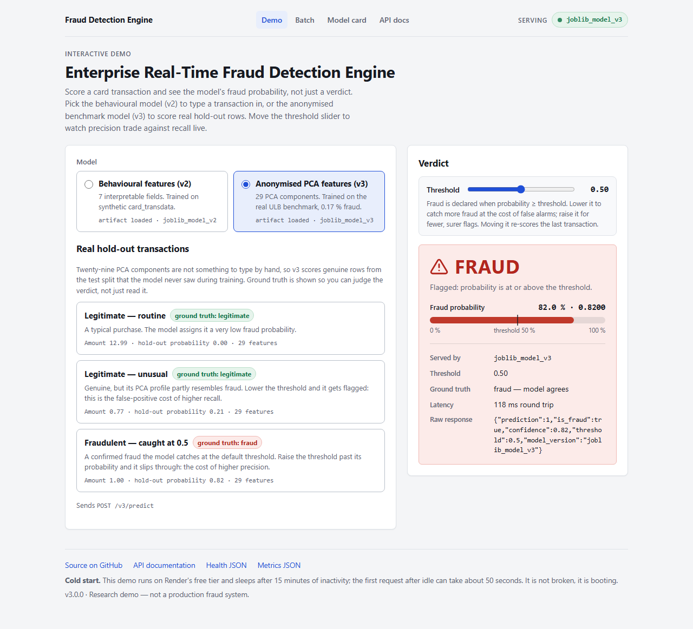

# Enterprise Real-Time Fraud Detection Engine

[](https://render.com/deploy?repo=https://github.com/pkbraide/mlops-fraud-detector)

[](https://github.com/pkbraide/mlops-fraud-detector/actions/workflows/ci-cd.yml)


A production-shaped fraud-scoring service with a browser UI, batch scoring and a
model card, built to be honest about what a public-benchmark model can and cannot
do. Two class-weighted scikit-learn random forests are served side by side:

- **v3** — trained on the **ULB Credit Card Fraud** benchmark (284,807 real,
  anonymised European card transactions, 492 frauds, **0.172 %** prevalence).
  This is the honest number: **PR-AUC 0.85, recall 0.76**.
- **v2** — trained on the synthetic `card_transdata` set (1,000,000 rows, 8.7 %
  fraud). It scores near-perfectly *because the data is easy*, and the model card
  says so in its first sentence.

Every scored response carries `confidence` (the model's fraud probability),
the `threshold` that was applied, and the `model_version` that produced it. The
rule-based fallback that keeps the API up without an artifact returns
`confidence: null` — it never invents a number.

**Live URL:** <https://mlops-fraud-detector.onrender.com> · [Model card](https://mlops-fraud-detector.onrender.com/model) · [Batch](https://mlops-fraud-detector.onrender.com/batch) · [Swagger UI](https://mlops-fraud-detector.onrender.com/docs)



> Hosted on Render's free tier, which spins down after 15 minutes of inactivity —
> the first request after idle can take 30–60 s. Every page says so.

---

## Table of contents

1. [Results — v3 first](#results--v3-first)
2. [Limitations](#limitations)
3. [Architecture](#architecture)
4. [Routes](#routes)
5. [Confidence and thresholds](#confidence-and-thresholds)
6. [Batch scoring](#batch-scoring)
7. [Fallback rules](#fallback-rules)
8. [Datasets and training](#datasets-and-training)
9. [Quick start](#quick-start)
10. [Testing & code quality](#testing--code-quality)
11. [CI/CD](#cicd)
12. [Deployment](#deployment)
13. [Project layout](#project-layout)

---

## Results — v3 first

Fraud-class metrics at the default 0.5 threshold on a stratified 20 % hold-out.
Neither model was tuned after its first fit: default `n_estimators`, no depth
limit, no threshold search, no resampling. The numbers are stored inside each
artifact at training time and served verbatim by `GET /metrics`; the model card
renders them from there.

| | **v3 — ULB creditcard (real)** | v2 — card_transdata (synthetic) |
|---|---|---|
| Rows / fraud prevalence | 284,807 / **0.173 %** (492) | 1,000,000 / 8.74 % (87,403) |
| Features | 29 (PCA V1–V28 + Amount) | 7 behavioural |
| Hold-out rows (frauds) | 56,962 (98) | 200,000 (17,481) |
| **Precision (fraud)** | **0.9487** | 1.0000 |
| **Recall (fraud)** | **0.7551** | 0.9997 |
| **F1 (fraud)** | **0.8409** | 0.9999 |
| **PR-AUC** | **0.8485** | 1.0000 |
| Confusion matrix (TN / FP / FN / TP) | 56,860 / 4 / **24** / 74 | 182,519 / 0 / 5 / 17,476 |
| Top features | V4 0.148 · V10 0.148 · V14 0.139 | ratio_to_median 0.542 · distance_from_home 0.199 |
| Licence | Public (OpenML 1597) | CC0 (OpenML 45955) |

v3 recall at other thresholds (from the notebook): 0.1 → P 0.76 / R 0.88 ·
0.3 → P 0.93 / R 0.82 · **0.5 → P 0.95 / R 0.76** · 0.7 → P 0.97 / R 0.70 ·
0.9 → P 0.98 / R 0.46. That curve is what the threshold slider on the demo page
walks along.

---

## Limitations

The v2 model scores near-perfectly because `card_transdata` is synthetic and its
fraud label is close to a deterministic function of two features. Real fraud runs
at roughly 0.1 % prevalence against adversaries who adapt. The v3 model, trained
on real anonymised transactions at 0.172 % prevalence, is the honest benchmark —
and its lower scores are the realistic ones. These results demonstrate the
pipeline, not detection capability.

**What these features cannot catch.** Both models see one transaction at a
time. There is no velocity or sequence (ten small purchases in five minutes, a
€1 test charge before a large one), no merchant identity or category, no
account or device context (new shipping address, new device, recent password
reset), no network effects (a merchant or IP already tied to confirmed fraud).
Fraud that looks like the cardholder — account takeover with the correct PIN, at
home, for a usual amount — is undetectable by construction with either feature
set. v3's components are anonymised PCA axes, so a high score cannot be
explained in business terms.

**Why PR-AUC, not accuracy.** At 0.172 % prevalence a model that never flags
anything is 99.83 % accurate. Accuracy is dominated by easy negatives; ROC-AUC
still rewards ranking a fraud above the enormous pool of trivial legitimate
rows. Precision–recall curves and their area are computed only from how many
frauds are retrieved and how clean the retrieved set is — analyst workload and
prevented loss. That is why the tables lead with fraud-class
precision/recall/F1 and PR-AUC and accuracy appears nowhere as a headline.

**Why the rule-based fallback exists.** A missing, corrupt or wrongly-ordered
artifact must not crash the route or silently score shuffled columns. It
switches to a fixed, documented rule, reports `model_version: "mock_rule"` and
`confidence: null`, and the header badge turns amber. The degraded state is
impossible to miss and the suite stays green under every artifact combination.

**Other honest caveats.** The OpenML copy of the ULB set omits the Kaggle `Time`
column, so v3 uses 29 features, not 30. Labels in production arrive weeks late
via chargebacks and are incomplete; here they are perfect and instant. There is
no drift, no seasonality and no adversary in a static snapshot.

---

## Architecture

```
  offline / batch     notebooks/train.ipynb (v2)            notebooks/train_v3.ipynb (v3)
                      fetch_openml(45955) 1M rows            fetch_openml(name="creditcard") 284,807 rows
                      RandomForest(class_weight=balanced)    RandomForest(class_weight=balanced)
                      joblib.dump({"model","features",       joblib.dump({...}) + 3 real hold-out presets
                        "metrics","dataset",...})            + sample_batch.csv from real hold-out rows
 ───────────────────────────────────┬───────────────────────────────────┬────────────────────────────────
  online / real-time                ▼                                   ▼
        ┌──────────────────────────────────────────────────────────────────────────────────────┐
        │  Docker python:3.10-slim · non-root · uvicorn ─► FastAPI                              │
        │                                                                                      │
        │   pages   GET /  /batch  /model         Jinja2 + /static/{css,js,data}  (HTML)       │
        │   json    GET /health  /metrics         per-route model_version + stored metrics     │
        │   score   POST /v3/predict ─► v3 forest ─┐   confidence = predict_proba[:,1]         │
        │           POST /v2/predict ─► v2 forest ─┤   prediction = confidence ≥ threshold     │
        │           POST /v2/batch   ─► v2 forest ─┘   fallback rule ─► confidence: null       │
        │           POST /predict    ─► v1 forest      deprecated, byte-identical to 1.0       │
        │                                                                                      │
        │   FraudDetectionModel singleton: dict artifacts carry their own feature order and    │
        │   are rejected on mismatch; each route reports the artifact that served it.          │
        └──────────────────────────────────────────────────────────────────────────────────────┘
                                    ▲
        ┌───────────────────────────┴──────────────────────────────────────────────────────────┐
        │ GitHub Actions: black ─► flake8 ─► pytest ×5 artifact combos ─► docker build          │
        │ ─► ls assets + 3 artifacts inside image ─► curl /, /batch, /model, /health, /metrics, │
        │    /static/*, /v3/predict, /v2/predict (threshold), /v2/batch, /predict, 404s        │
        └──────────────────────────────────────────────────────────────────────────────────────┘
```

---

## Routes

| Method | Path | Kind | Description |
|---|---|---|---|
| `GET` | `/` | HTML | Interactive demo: v2 form or v3 real-row presets, confidence bar, live threshold slider. |
| `GET` | `/batch` | HTML | CSV upload UI for `/v2/batch`, results table, client-side CSV download. |
| `GET` | `/model` | HTML | Model card: limitations first, then v3-vs-v2 metrics, confusion matrices, importances — all from `/metrics`. |
| `GET` | `/health` | JSON | Status, app version, top-level `model_version`, `mock_mode`, per-model load status, and every route with the artifact serving it. |
| `GET` | `/metrics` | JSON | Dataset metadata, metrics, confusion matrix, feature importances, training info for v3/v2/v1, read from the artifacts. |
| `POST` | `/v3/predict` | JSON | Score V1–V28 + Amount with the ULB model. Optional `threshold`. |
| `POST` | `/v2/predict` | JSON | Score the 7 behavioural features with the card_transdata model. Optional `threshold`. |
| `POST` | `/v2/batch` | multipart | Upload a CSV (≤ 2 MB, ≤ 1000 rows); per-row prediction + confidence and a summary. Optional `?threshold=`. |
| `POST` | `/predict` | JSON | **Deprecated** v1 contract (3 synthetic features). Byte-identical to 1.0; no confidence. |
| `GET` | `/docs`, `/openapi.json` | — | Swagger UI and schema. `/predict` is marked `deprecated: true`. |
| any | unknown path | — | HTML 404 page for page-like paths; JSON `{"detail":"Not Found"}` under `/v2/`, `/v3/`, `/static/` and other API prefixes. |

Pages and `/health` answer `HEAD` as well as `GET`, so uptime monitors and
`curl -I` get a 200.

### `POST /v3/predict`

Body: 29 required floats `V1` … `V28`, `Amount`, plus optional `threshold`
(default 0.5, must satisfy `0 < threshold < 1`). Unknown fields are rejected
(422), so a 30-feature payload fails loudly rather than being silently truncated.

```bash
# score the "fraud_caught" preset (a real hold-out row) from the shipped presets file
python3 -c "import json;p=json.load(open('app/static/data/v3_presets.json'))['presets'];print(json.dumps([x for x in p if x['id']=='fraud_caught'][0]['values']))" > /tmp/v3.json
curl -s -X POST https://mlops-fraud-detector.onrender.com/v3/predict -H "Content-Type: application/json" -d @/tmp/v3.json
# {"prediction":1,"is_fraud":true,"confidence":0.82,"threshold":0.5,"model_version":"joblib_model_v3"}
```

### `POST /v2/predict`

```bash
curl -s -X POST https://mlops-fraud-detector.onrender.com/v2/predict \
  -H "Content-Type: application/json" \
  -d '{"distance_from_home": 100.009, "distance_from_last_transaction": 3.4752,
       "ratio_to_median_purchase_price": 1.66, "repeat_retailer": 1, "used_chip": 0,
       "used_pin_number": 0, "online_order": 1, "threshold": 0.9}'
# {"prediction":0,"is_fraud":false,"confidence":0.74,"threshold":0.9,"model_version":"joblib_model_v2"}
# same payload with "threshold": 0.1 → "prediction":1
```

### `POST /predict` (deprecated)

```bash
curl -s -X POST https://mlops-fraud-detector.onrender.com/predict \
  -H "Content-Type: application/json" \
  -d '{"amount": 2500, "distance_from_home": 180.0, "use_chip": 0}'
# {"prediction":1,"is_fraud":true,"model_version":"joblib_model"}
```

---

## Confidence and thresholds

- `confidence` is `predict_proba` for the positive class, rounded to 4 dp.
- `prediction = 1` when `confidence ≥ threshold`; `threshold` defaults to 0.5 and
  is echoed in every response.
- `threshold` is validated as `0 < threshold < 1`; `0`, `1`, `1.5` and `"abc"`
  all return 422.
- On the rule-based fallback `confidence` is `null` and `threshold` has no
  effect — the response still says which rule served it.
- The demo page's slider re-sends the last request with the new threshold; on
  the v3 "fraud — caught at 0.5" preset (p = 0.82) dragging past 0.80 turns the
  verdict to LEGITIMATE while the ground-truth chip still says fraud. That is the
  precision/recall trade-off made visible.
- `POST /predict` (v1) is untouched: no confidence, no threshold, same bytes as 1.0.

---

## Batch scoring

`POST /v2/batch` takes a multipart field `file` (`.csv`, UTF-8, ≤ 2 MB,
≤ 1000 data rows) whose header contains the seven v2 columns in any order.

```bash
curl -s -X POST "https://mlops-fraud-detector.onrender.com/v2/batch?threshold=0.5" \
  -F "file=@app/static/data/sample_batch.csv;type=text/csv"
```

```json
{
  "model_version": "joblib_model_v2",
  "threshold": 0.5,
  "summary": {"total": 25, "flagged": 5, "flag_rate": 0.2, "processing_ms": 36.7,
              "threshold": 0.5, "model_version": "joblib_model_v2"},
  "rows": [{"row": 1, "inputs": {"distance_from_home": 40.8014, "...": "..."},
            "prediction": 0, "is_fraud": false, "confidence": 0.0}, "..."]
}
```

Malformed input is a `400` that names the problem — `Missing required
column(s): …`, `Column 'used_chip' must contain only 0 or 1 (e.g. line(s) [2])`,
`Only .csv files are accepted`, `Too many rows: 1001` — and a file over 2 MB is
`413`. No stack traces leak. The sample file
(`app/static/data/sample_batch.csv`) is 25 real hold-out rows, five of them
confirmed fraud, written by the training notebook.

---

## Fallback rules

| Route | Artifact | `model_version` when loaded | Fallback rule (→ `mock_rule`, `confidence: null`) |
|---|---|---|---|
| `/v3/predict` | `models/fraud_model_v3.joblib` | `joblib_model_v3` | `V14 < -5.0 and V10 < -3.0` (the two most important components; thresholds from training-set quantiles) |
| `/v2/predict`, `/v2/batch` | `models/fraud_model_v2.joblib` | `joblib_model_v2` | `(ratio_to_median_purchase_price > 4 or distance_from_home > 100) and online_order == 1 and used_pin_number == 0` |
| `/predict` | `models/fraud_model.joblib` | `joblib_model` | `amount > 1000 and distance_from_home > 50 and use_chip == 0` |

The top-level `model_version` on `/health` is the most capable artifact loaded
(v3 > v2 > v1 > `mock_rule`); each route additionally reports its own. Dict
artifacts are rejected if they are not `{"model", "features", …}`, if the
feature order differs from the API's, or if the estimator has no
`predict_proba`.

---

## Datasets and training

| | v3 | v2 | v1 |
|---|---|---|---|
| Notebook | [`notebooks/train_v3.ipynb`](notebooks/train_v3.ipynb) | [`notebooks/train.ipynb`](notebooks/train.ipynb) | original synthetic notebook (v1 artifact kept) |
| Source | OpenML **1597** `creditcard`, resolved **by name** and asserted (284,807 rows, 492 frauds) | OpenML **45955** `Credit_Card_Fraud_` (`card_transdata`) | `make_classification` |
| Provenance | Worldline / ULB Machine Learning Group; Dal Pozzolo et al., *Calibrating Probability with Undersampling for Unbalanced Classification*, IEEE CIDM 2015 | Kaggle `card_transdata.csv`, uploaded to OpenML 2024 | synthetic |
| Licence (as declared on OpenML) | Public | Public Domain (CC0) | n/a |
| Split | stratified 80/20, `random_state=42` | stratified 80/20, `random_state=42` | 80/20 |
| Model | `RandomForestClassifier(class_weight="balanced", n_jobs=-1, random_state=42)` | same | `RandomForestClassifier(n_estimators=100)` |
| Fit time | 41 s | 39 s | < 1 s |
| Artifact | 1.12 MB dict, `compress=3` | 1.14 MB dict, `compress=3` | 3.5 MB bare estimator |
| Extras written | `app/static/data/v3_presets.json` — 3 real hold-out rows with ground truth and stored probability | `app/static/data/sample_batch.csv` — 25 real hold-out rows | — |

Both notebooks are executed in place and their outputs committed. Re-run with:

```bash
pip install jupyter nbconvert
jupyter nbconvert --to notebook --execute notebooks/train.ipynb --inplace
jupyter nbconvert --to notebook --execute notebooks/train_v3.ipynb --inplace
```

The raw OpenML downloads are cached under `data/` (git-ignored, anchored to the
repo root so that `app/static/data/` stays tracked).

---

## Quick start

```bash
git clone https://github.com/pkbraide/mlops-fraud-detector.git
cd mlops-fraud-detector
python3 -m venv venv && source venv/bin/activate     # Windows: venv\Scripts\activate
pip install --upgrade pip && pip install -r requirements.txt
uvicorn app.main:app --reload --port 8000
```

Open <http://localhost:8000> (demo), `/batch`, `/model`, `/docs`.

```bash
docker build -t mlops-fraud-detector .
docker run --rm -p 8000:8000 mlops-fraud-detector
docker run --rm -e PORT=7860 -p 7860:7860 mlops-fraud-detector   # $PORT is honoured
```

The UI is vanilla HTML/CSS/JS served by the same process — no npm, no bundler,
no CDN. Light and dark via `prefers-color-scheme`; every page usable at 375 px
with no horizontal overflow (verified headlessly).

---

## Testing & code quality

```bash
black --check . && flake8 . && pytest -v      # 74 tests
```

The suite covers pages (200, `text/html`, titles, HEAD), static assets, HTML vs
JSON 404s, `/health` listing every route with its artifact, `/metrics` blocks
for v1/v2/v3, v1 byte-compatibility, v2 and v3 valid/invalid payloads, feature
count errors, confidence range and `null`-on-fallback, threshold behaviour on
borderline rows and threshold validation, and every batch error path. It is run
under **five artifact combinations** — all, v3 only, v2 only, v1 only, none —
locally and in CI; assertions that depend on a trained boundary are conditioned
on the per-model mock flag.

---

## CI/CD

[`.github/workflows/ci-cd.yml`](.github/workflows/ci-cd.yml), on every push and
pull request to `main`:

1. `black --check`, `flake8`, `pytest -v`
2. `pytest -q` four more times with artifacts hidden (v3 only / v2 only / v1 only / none)
3. `docker build`
4. Inside the built image: `ls` and `test -f` on every template, stylesheet,
   script, data file and all three `.joblib` artifacts, as the non-root user
5. Run the container and curl `/health`, `/` (HTML + HEAD), `/batch`, `/model`,
   every static asset, `/metrics` (assert all three loaded), `/v3/predict`
   (assert `confidence: 0.82`), `/v2/predict` at threshold 0.9 (assert `0.74` →
   legit), `/v2/batch` (assert 25 rows, 5 flagged), `/predict` (assert no
   `confidence` key) and both 404 flavours

Render redeploys `main` automatically.

---

## Deployment

**Render (live):** `render.yaml` declares one Docker web service (`plan: free`,
`region: frankfurt`, `healthCheckPath: /health`, `autoDeploy: true`). Apply it
from the dashboard (New → Blueprint) or the button at the top. For redeploys
from a terminal, copy the service's Deploy Hook and
`export RENDER_DEPLOY_HOOK_URL=…; curl -X POST "$RENDER_DEPLOY_HOOK_URL"`.

**Hugging Face Spaces:** the frontmatter at the top makes this a valid Docker
Space (`sdk: docker`, `app_port: 8000`):
`huggingface-cli repo create mlops-fraud-detector --type space --space_sdk docker`,
then `git remote add hf https://huggingface.co/spaces/<you>/mlops-fraud-detector && git push hf main`.

---

## Project layout

```
mlops-fraud-detector/
├── .github/workflows/ci-cd.yml      # lint → tests ×5 combos → docker build → in-image checks → smoke test
├── app/
│   ├── main.py                      # FastAPI: pages, /health, /metrics, /v3 /v2 /v2/batch, deprecated /predict, 404s
│   ├── model_utils.py               # FraudDetectionModel: v3/v2/v1 slots, thresholds, confidence, batch, reports
│   ├── templates/                   # base, index (demo), batch, model (card), 404
│   └── static/
│       ├── css/style.css            # one accent, neutral scale, light + dark
│       ├── js/{common,demo,batch,model}.js
│       └── data/{v3_presets.json,sample_batch.csv}   # real hold-out rows written by the notebooks
├── docs/ui-screenshot.png           # rendered headlessly at 1280 px
├── models/
│   ├── fraud_model.joblib           # v1 bare estimator (deprecated route)
│   ├── fraud_model_v2.joblib        # {"model","features","metrics","dataset",...}
│   └── fraud_model_v3.joblib        # {"model","features","metrics","dataset",...}
├── notebooks/train.ipynb            # v2 (card_transdata)
├── notebooks/train_v3.ipynb         # v3 (ULB creditcard)
├── tests/test_api.py                # 74 contract tests, artifact-combination aware
├── Dockerfile · .dockerignore · .gitignore · .gitattributes · setup.cfg
├── render.yaml · requirements.txt · README.md
```

## License

Code: MIT. Data: OpenML 1597 (`creditcard`) is declared "Public" by its
uploader and should be cited as Dal Pozzolo et al. (2015); OpenML 45955 is
declared CC0. No cardholder-identifying data exists in either dataset or is
stored by this service.
